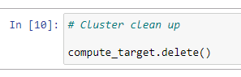

# Optimizing an ML Pipeline in Azure

## Overview
This project is part of the Udacity Azure ML Nanodegree.
In this project, we build and optimize an Azure ML pipeline using the Python SDK and a provided Scikit-learn model.
This model is then compared to an Azure AutoML run.

## Useful Resources
- [ScriptRunConfig Class](https://docs.microsoft.com/en-us/python/api/azureml-core/azureml.core.scriptrunconfig?view=azure-ml-py)
- [Configure and submit training runs](https://docs.microsoft.com/en-us/azure/machine-learning/how-to-set-up-training-targets)
- [HyperDriveConfig Class](https://docs.microsoft.com/en-us/python/api/azureml-train-core/azureml.train.hyperdrive.hyperdriveconfig?view=azure-ml-py)
- [How to tune hyperparamters](https://docs.microsoft.com/en-us/azure/machine-learning/how-to-tune-hyperparameters)

## Summary
This dataset contains data about individuals who are applying for bank loans. We seek to predict wheter each individualer will subscribe to a service or not. Therefore we use the based information about each individual."

The best performing model was a the voting ensemble with ...% accuracy. There were also a lot of other models with a comparable accuracy."

## Scikit-learn Pipeline
The Scikit-learn pipeline uses the provided data from the given URL as input. After download a cleaning function is used to to the folllowing steps:
- Removing NaNs from the dataset
- One-hot encoding job titles, contact and education variables
- Encoding a additional categorical vales
- Enconding months of the year
- Encoding the target variable.

After cleaning the data is split into train and test dataset and a logistic regression model is fitted. Logistic regression uses a fitted logistic function and a threshold. The available parameters within the training script are C and max_iter.

The RandomParameterSampling is then used to change the discrete values for C and max_iter. C is the Reularization while max_iter is the maximum number of iterations. This sampler was chosen, because it is a fast one which supports early termination of low-performance runs. For exhaustive search we can also GridParameterSampling or BayesianParameterSampling to explore the hyperparameter space (more budget needed).

The BanditPolicy stopping policy is uused, because it allows to select a cut-off which models reporting metrics worse than the current best model is terminated. This has benefits for computational efficiency.

## AutoML
The AutoML pipeline is very similar to the Scikit-learn pipeline, which is described above. The data is retrieved from the given URL link and cleaned with the same function described above. The data is then not splitted into test and train dataset. The variables and target dataframes are merged prior to the autoML process. The joined dataset is used as input in the autoML configuration and the autoML run is processed. I choose accuracy as primary metric and classification as task.

The best model selected by autoML was a voting ensemble with 91,66 % accuracy.

## Pipeline comparison
**Compare the two models and their performance. What are the differences in accuracy? In architecture? If there was a difference, why do you think there was one?**

## Future work
The following steps are possible to improve the model with future work:
- running AutoML for much longer to find better models
- Exploring hyperdrive with higher variety of classification models
- Since the data is very imbalanced, use a different metric like AUC_weighted, which is better for imbalanced data

## Proof of cluster clean up

